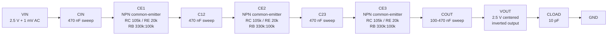

# 3-Stage BJT Neural Signal Amplifier 초기 회로 설계도

## 1. 목표 사양 요약

| 항목 | 목표 |
| --- | --- |
| 구조 | Single-ended amplifier |
| Supply voltage | 5 V |
| 기준 전압 | 2.5 V |
| 입력 조건 | 2.5 V common-mode + 1 mV AC |
| Midband gain | 40 dB, 약 100 V/V |
| Target bandwidth | 10 Hz - 20 kHz |
| Roll-off | 저주파/고주파 양쪽에서 약 80 dB/decade |
| Load | 10 pF |
| 기본 구조 | NPN BJT 3-stage common-emitter amplifier |

기존 1-stage 검증 결과에서 CE stage 하나의 1 kHz gain은 약 4.48 V/V이다. 3단 직렬 구성 시 이론적인 전체 gain은 약 4.48^3 = 90.0 V/V, 즉 약 39.1 dB이므로, collector resistor를 약간 키우거나 stage별 bias를 조정해 목표 40 dB 근처로 맞춘다.

## 2. 전체 3-Stage BJT Amplifier 블록도



## 3. CE Stage 내부 회로도

아래 CE stage를 3번 반복한다. 각 stage는 독립적인 base bias divider를 가지며, stage 사이에는 coupling capacitor를 넣어 앞단 collector DC bias가 다음 단 base bias를 직접 밀지 않도록 한다.

```text
                 VDD = 5 V
                    |
                  RC 105k
                    |
stage in --C--+---- collector ---- stage out
              |        |
            RB_TOP     | QNPN npn_05v5
             330k      |
              |       emitter
             base       |
              |       RE 20k
            RB_BOT      |
             100k      GND
              |
             GND

collector -- CH 47 pF ~ 150 pF -- GND
          high-frequency pole tuning
```

## 4. 초기 소자값

| 이름 | 초기값 | 역할 |
| --- | ---: | --- |
| Q1, Q2, Q3 | npn_05v5, mult=1 | 각 CE stage의 증폭 소자 |
| RB_TOP | 330 kOhm | Base bias divider 상단 저항 |
| RB_BOT | 100 kOhm | Base bias divider 하단 저항 |
| RC | 105 kOhm | Collector resistor, gain/headroom 조정 |
| RE | 20 kOhm | Emitter degeneration, bias 안정화 및 linearity 확보 |
| CIN | 470 nF sweep | 입력 DC 2.5 V와 CE1 base bias 분리 |
| C12 | 470 nF sweep | CE1 collector DC와 CE2 base bias 분리 |
| C23 | 470 nF sweep | CE2 collector DC와 CE3 base bias 분리 |
| COUT | 100 nF - 470 nF sweep | CE3 collector DC와 출력 2.5 V rebias 분리 |
| ROUT_TOP | 1 MOhm | 출력 rebias divider 상단 저항 |
| ROUT_BOT | 1 MOhm | 출력 rebias divider 하단 저항 |
| CH1, CH2, CH3 | 47 pF - 150 pF sweep | 20 kHz 근처 high-frequency pole 조정 |
| CLOAD | 10 pF | 프로젝트 지정 load capacitor |

## 5. 각 소자의 설계 역할

- `RB_TOP`과 `RB_BOT`은 각 CE stage의 base DC bias를 독립적으로 만든다.
- `RC`는 voltage gain을 키우지만, 너무 크면 collector headroom이 줄어 clipping 위험이 커진다.
- `RE`는 gain을 낮추는 대신 bias 안정성, 선형성, transient 왜곡 측면에서 유리하다.
- `CIN`, `C12`, `C23`은 DC를 차단하고 stage별 bias를 분리한다. 동시에 10 Hz 근처 lower cutoff 형성에 관여한다.
- `COUT`, `ROUT_TOP`, `ROUT_BOT`은 최종 출력을 2.5 V common-mode 근처로 다시 잡는다.
- `CH1`, `CH2`, `CH3`은 고주파 감쇠를 만들기 위한 tuning capacitor이다. 목표 upper cutoff 20 kHz와 약 80 dB/decade roll-off에 맞춰 sweep한다.
- `CLOAD`는 실제 평가 조건인 10 pF load를 반영한다.

## 6. 시뮬레이션 전 확인 항목

1. DC operating point에서 모든 BJT의 `VBE`가 정상 범위인지 확인한다.
2. 각 stage의 `VCE`가 충분하여 saturation이나 rail 고착이 없는지 확인한다.
3. CE3 collector의 swing이 1 mV 입력에 대해 약 100 mV 출력 진폭을 감당할 수 있는지 확인한다.
4. Output rebias 후 `VOUT` common-mode가 2.5 V 근처인지 확인한다.
5. AC simulation에서 midband gain이 40 dB 근처인지 확인한다.
6. 10 Hz lower cutoff와 20 kHz upper cutoff가 목표 `H(s)`와 얼마나 가까운지 비교한다.
7. `10 pF` load 연결 전후 gain loss, cutoff shift, ringing 여부를 비교한다.
8. Transient simulation에서 clipping, overshoot, ringing, settling delay를 확인한다.
9. 3개의 CE stage 때문에 최종 출력이 입력 대비 반전된다는 점을 waveform 비교와 발표자료에 명시한다.
10. Capacitor area와 static current가 PPA 점수에 주는 영향을 sweep 결과표에 함께 기록한다.

## 7. 초기 판단

이 초기 회로는 OPAMP를 사용하지 않고 BJT 3개를 중심으로 목표 40 dB gain에 접근하는 저면적 후보이다. 가장 중요한 tuning 지점은 `RC`, `RE`, `CIN/C12/C23`, `COUT`, `CH1/CH2/CH3`이다. 우선 DC operating point와 1 kHz gain을 확인한 뒤, low-frequency pole과 high-frequency pole을 순서대로 맞추는 방식으로 최종 후보를 좁힌다.
