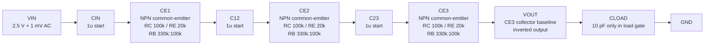

# 3-Stage BJT Neural Signal Amplifier 검증 반영 설계도

## 1. 목표 사양 요약

| 항목 | 목표 |
| --- | --- |
| 구조 | Single-ended amplifier |
| Supply voltage | 5 V |
| 기준 전압 | 2.5 V |
| 입력 조건 | 2.5 V common-mode + 1 mV AC |
| Midband gain | 40 dB, 약 100 V/V |
| Target bandwidth | 10 Hz - 20 kHz |
| Roll-off | 저주파/고주파 양쪽에서 약 80 dB/decade |
| Load | 10 pF |
| 기본 구조 | NPN BJT 3-stage common-emitter amplifier |

기존 1-stage 검증 결과에서 CE stage 하나의 1 kHz gain은 `4.48219 V/V`이고 `13.0298 dB`이다. transient gain은 `4.485 V/V`, output center는 약 `3.365835 V`였다. 3단 직렬 구성 시 이론적인 전체 gain은 약 `4.48219^3 = 90.1 V/V`, 즉 약 `39.1 dB`이므로, 검증된 `RC=100k`, `RE=20k`, `RB_TOP=330k`, `RB_BOT=100k`를 3-stage baseline으로 둔다.

2-stage OP 검증에서는 두 stage가 독립 bias를 유지했다. stage 1은 `VBE=0.793688 V`, `VCE=3.030645 V`, stage 2는 `VBE=0.793688 V`, `VCE=3.030309 V`였고, `vout_final=3.365828 V`, `Istatic=56.1394 uA`, `PDC=280.697 uW`로 확인됐다.

## 2. 전체 3-Stage BJT Amplifier 블록도



## 3. CE Stage 내부 회로도

아래 CE stage를 3번 반복한다. 각 stage는 독립적인 base bias divider를 가지며, stage 사이에는 coupling capacitor를 넣어 앞단 collector DC bias가 다음 단 base bias를 직접 밀지 않도록 한다.

```text
                 VDD = 5 V
                    |
                  RC 100k
                    |
stage in --C--+---- collector ---- stage out
              |        |
            RB_TOP     | QNPN npn_05v5
             330k      |
              |       emitter
             base       |
              |       RE 20k
            RB_BOT      |
             100k      GND
              |
             GND

collector -- CH sweep candidate -- GND
          high-frequency pole tuning after baseline
```

## 4. 초기 소자값

| 이름 | 초기값 | 역할 |
| --- | ---: | --- |
| Q1, Q2, Q3 | npn_05v5, mult=1 | 각 CE stage의 증폭 소자 |
| RB_TOP | 330 kOhm | Base bias divider 상단 저항 |
| RB_BOT | 100 kOhm | Base bias divider 하단 저항 |
| RC | 100 kOhm | 검증된 collector resistor baseline |
| RE | 20 kOhm | Emitter degeneration, bias 안정화 및 linearity 확보 |
| CIN | 1u | 입력 DC 2.5 V와 CE1 base bias 분리 시작점 |
| C12 | 1u | CE1 collector DC와 CE2 base bias 분리 시작점 |
| C23 | 1u | CE2 collector DC와 CE3 base bias 분리 시작점 |
| COUT | 검증 대상 | CE3 collector direct output 통과 뒤 output rebias 후보로 평가 |
| ROUT_TOP | 검증 대상 | output rebias 후보 사용 시 divider 상단 저항 |
| ROUT_BOT | 검증 대상 | output rebias 후보 사용 시 divider 하단 저항 |
| CH1, CH2, CH3 | sweep candidate | unloaded baseline 통과 뒤 high-frequency pole 조정 후보 |
| CLOAD | 10 pF | `bjt3_load10p_ac/tran`에서만 연결하는 프로젝트 지정 load capacitor |

## 5. PDK include 및 NPN instance 기준

BJT 검증 netlist는 전체 library include를 기본 경로로 쓰지 않는다. Windows/ngspice 환경에서 아래 경로는 MOS/ESD 관련 fatal error가 확인된 known failing path이다.

```spice
.lib "C:/eda/sky130/skywater-pdk-libs-sky130_fd_pr/models/sky130.lib.spice" tt
```

3-stage BJT 검증은 필요한 BJT model만 직접 include한다.

```spice
.include "C:/eda/sky130/skywater-pdk-libs-sky130_fd_pr/models/corners/tt/nonfet.spice"
.include "C:/eda/sky130/skywater-pdk-libs-sky130_fd_pr/cells/npn_05v5/sky130_fd_pr__npn_05v5__t.corner.spice"
```

`npn_05v5`는 4-pin subckt로 instance한다.

```spice
XQ1 collector base emitter 0 sky130_fd_pr__npn_05v5_W1p00L1p00 mult=1
```

## 6. 각 소자의 설계 역할

- `RB_TOP`과 `RB_BOT`은 각 CE stage의 base DC bias를 독립적으로 만든다.
- `RC`는 voltage gain을 키우지만, 너무 크면 collector headroom이 줄어 clipping 위험이 커진다.
- `RE`는 gain을 낮추는 대신 bias 안정성, 선형성, transient 왜곡 측면에서 유리하다.
- `CIN`, `C12`, `C23`은 DC를 차단하고 stage별 bias를 분리한다. 동시에 10 Hz 근처 lower cutoff 형성에 관여한다.
- CE3 collector가 자동으로 2.5 V common-mode 출력이 된다고 단정하지 않는다. output coupling/rebias는 unloaded baseline 이후의 검증 대상이다.
- `CH1`, `CH2`, `CH3`은 고주파 감쇠를 만들기 위한 sweep 후보이다. 목표 upper cutoff 20 kHz와 약 80 dB/decade roll-off에 맞춰 baseline 이후 평가한다.
- `CLOAD`는 실제 평가 조건인 10 pF load를 반영하되, unloaded `bjt3_ac/tran` 통과 뒤 `bjt3_load10p_ac/tran`에서 비교한다.

## 7. 시뮬레이션 순서와 gate

1. `bjt3_op.spice`: `RC=100k`, `RE=20k`, `RB_TOP=330k`, `RB_BOT=100k`, `C12=1u`, `C23=1u`로 3개 stage DC operating point를 확인한다.
2. `bjt3_ac.spice`: `CIN=1u`, `C12=1u`, `C23=1u`의 unloaded AC response에서 1 kHz midband gain을 확인한다.
3. `bjt3_tran.spice`: unloaded transient에서 `1 mV`, `1 kHz` 입력에 대한 output swing과 clipping을 확인한다.
4. `bjt3_load10p_ac.spice`와 `bjt3_load10p_tran.spice`: final output node에만 `10 pF` load를 붙이고 unloaded baseline과 비교한다.
5. 통과한 baseline 이후에만 `RC/RE`, coupling capacitor, `CH1/CH2/CH3`, output rebias family를 한 번에 하나씩 sweep한다.

## 8. 시뮬레이션 전 확인 항목

1. DC operating point에서 모든 BJT의 `VBE`가 정상 범위인지 확인한다.
2. 각 stage의 `VCE`가 충분하여 saturation이나 rail 고착이 없는지 확인한다.
3. CE3 collector의 swing이 1 mV 입력에 대해 약 100 mV 출력 진폭을 감당할 수 있는지 확인한다.
4. CE3 collector direct output과 output rebias 후보를 분리해 `VOUT` common-mode를 확인한다.
5. AC simulation에서 midband gain이 40 dB 근처인지 확인한다.
6. 10 Hz lower cutoff와 20 kHz upper cutoff가 목표 `H(s)`와 얼마나 가까운지 비교한다.
7. `10 pF` load 연결 전후 gain loss, cutoff shift, ringing 여부를 비교한다.
8. Transient simulation에서 clipping, overshoot, ringing, settling delay를 확인한다.
9. 3개의 CE stage 때문에 최종 출력이 입력 대비 반전된다는 점을 waveform 비교와 발표자료에 명시한다.
10. Capacitor area와 static current가 PPA 점수에 주는 영향을 sweep 결과표에 함께 기록한다.

## 9. 현재 판단

이 회로는 OPAMP를 사용하지 않고 BJT 3개를 중심으로 목표 40 dB gain에 접근하는 저면적 후보이다. 현재 accepted 후보는 `RC=120k`, `RE=20k`, `RB_TOP=3.3Meg`, `RB_BOT=1Meg`, `CIN=1u`, `C12=1u`, `C23=1u`, `CH1=CH2=CH3=30p`이다. final candidate netlist stem은 `bjt3_sweep_highcut_ch30p_ac/tran`이다.

`bjt3_op.spice` DC 검증은 통과했다. stage 1/2/3의 `VBE`는 모두 약 `0.793688 V`이고, `VCE`는 각각 `3.030645 V`, `3.030645 V`, `3.030309 V`이다. `vout_final=3.365828 V`, `Istatic=84.2075 uA`, `PDC=421.038 uW`이며, `C12`와 `C23` 모두 DC short처럼 동작하지 않았다.

`bjt3_ac.spice` unloaded AC 검증은 `RB_TOP/RB_BOT=3.3Meg/1Meg`, `RC=120k`, `RE=20k`, `CIN/C12/C23=1u` 후보에서 통과했다. 1 kHz gain은 `79.5095 V/V`, `38.0084 dB`이고, phase는 `-3.14071 deg`이다. 10 Hz to 20 kHz gain ripple은 약 `0.0144342 dB`였으며, 1 Hz to 1 MHz sweep 안에서 -3 dB cutoff는 발견되지 않았다.

`bjt3_tran.spice` unloaded transient 검증도 같은 후보에서 통과했다. `1 mV`, `1 kHz` 입력에서 `vin_pp=0.00200 V`, `out_pp=0.15899 V`, transient gain은 `79.4950 V/V`였다. 출력 중심은 `3.870195 V`이고, `out_min=3.79070 V`, `out_max=3.94969 V`로 rail clipping 없이 동작했다. waveform은 3-stage CE 구조에 맞게 입력 대비 반전된다.

`bjt3_load10p_ac.spice`와 `bjt3_load10p_tran.spice` 10 pF load 검증도 같은 후보에서 통과했다. loaded 1 kHz gain은 `38.0081374 dB`로 unloaded 대비 gain loss가 `-0.0002626 dB`이며, loaded upper cutoff는 약 `131916.53 Hz`로 20 kHz 목표 대역보다 높다. loaded transient는 `out_pp=0.15898 V`, 출력 중심 `3.87020 V`, `out_min=3.79071 V`, `out_max=3.94969 V`로 ringing 또는 rail clipping 없이 동작했다.

Cycle F `high_cutoff_shape` sweep은 `CH1=CH2=CH3`만 바꿔 `22p`, `30p`, `39p`를 비교했다. 세 후보 모두 ngspice와 공통 로그 검증은 통과했다. `CH=30p` 후보는 loaded 1 kHz gain `38.001764 dB`, upper cutoff `23005.02 Hz`, transient `out_pp=0.158871 V`, output center `3.870199 V`, load gain delta `-0.006636 dB`로 accepted이다. `CH=22p`는 upper cutoff `29860.35 Hz`로 목표보다 높고, `CH=39p`는 upper cutoff `18279.37 Hz`로 20 kHz target edge 아래라 rejected이다. 다음 구현 run은 final metrics와 제출 산출물 생성을 위한 Cycle G이다.
